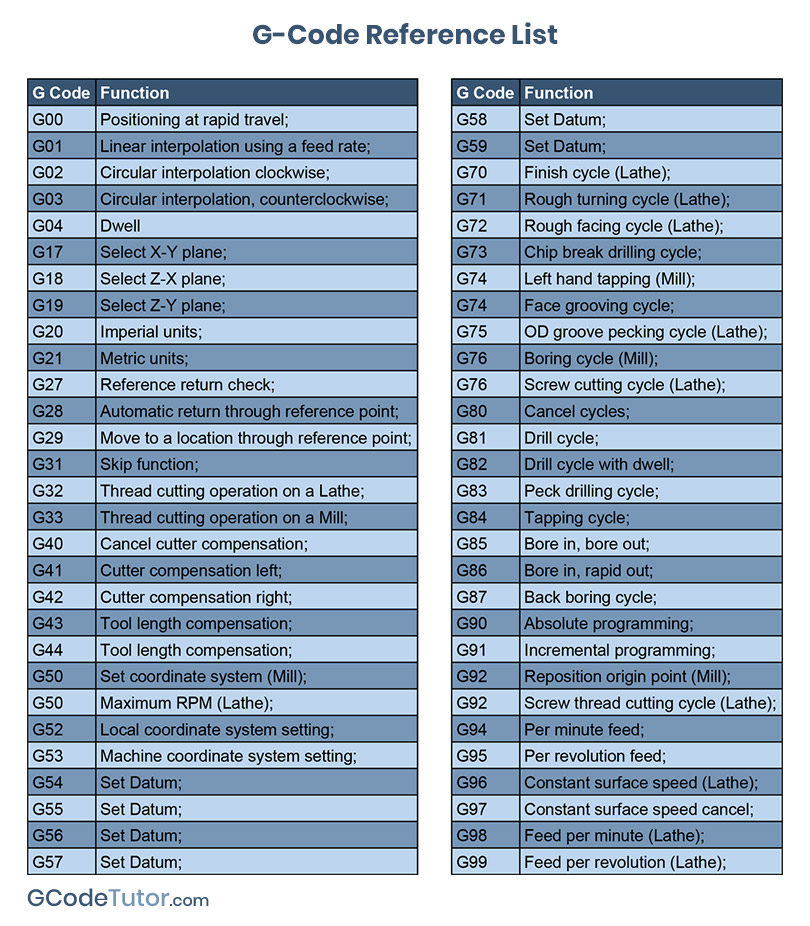

# G01 - Linear Interpolation
- A G01 command is used when you are cutting in a straight line. This command has to have a feed rate (F) active before it will run.
- This command can be used with all axis cutting at the same time, or just one. It is not common to cut with the Z axis as well as X and Y but it is possible if needed.
# G02 and G03 - Circular Interpolation
- G02 is used to machine an arc or radius in a clockwise direction and G03 is for anti clockwise. Using an R value to define the radius, the G02/G03 command moves the cutter in a straight line with the defined radius at the end of this move
# G04 - Dwell
- Sometimes we need to pause the cutter for a brief moment, for that we add a dwell to the code to stop the machine from continuing reading the program for a specified amount of time.

`